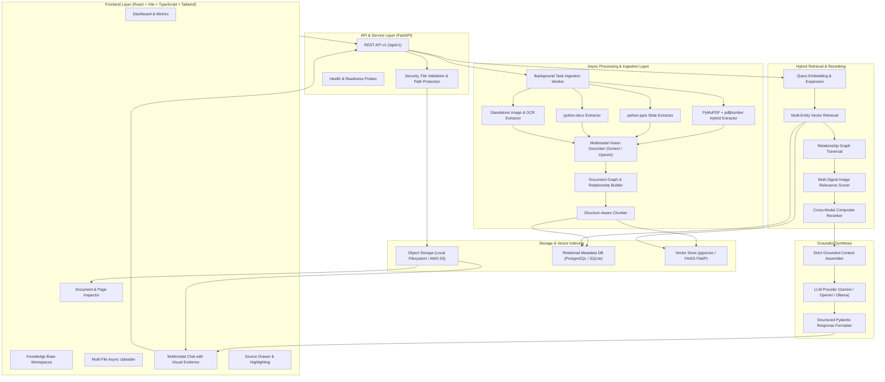

# System Architecture: Multimodal RAG Platform

## 1. Overview

The **Multimodal RAG Platform** is an enterprise-ready, production-grade AI platform designed to extract, index, retrieve, and synthesize information across text, structured tables, and original visual artifacts (diagrams, charts, flowcharts, figures, and screenshots).

Unlike traditional text-only RAG pipelines that discard or ignore non-textual evidence, this platform treats **original visual evidence as a first-class citizen of the answer**.

---

## 2. End-to-End System Architecture



---

## 3. Core Architectural Modules

### 3.1. Frontend Architecture (`frontend/`)
- **Technology Stack**: React 18 / 19, TypeScript, Vite, Tailwind CSS, Lucide Icons, Axios.
- **Component Design**:
  - `Navbar`: Global workspace navigation, active Knowledge Base switcher, real-time health indicator.
  - `DashboardPage`: Executive KPI cards, vector count, extracted visual asset counts, recent document activity.
  - `KnowledgeBasesPage`: Workspace isolation, create/delete knowledge bases, document counters.
  - `DocumentsPage`: Ingestion queue monitoring (`UPLOADING`, `PROCESSING`, `INDEXING`, `COMPLETED`, `FAILED`), page counts, inspection actions.
  - `ChatPage`: AI conversational interface with thread management, message feed, grounded answer cards, **Visual Evidence Grid** (`VisualEvidenceCard`), **Interactive Tables** (`TableViewer`), and expandable **Source Citations**.
  - `SourceDrawer`: Deep inspection drawer displaying original rendered page previews, extracted images, tables, and raw text.
  - `FileUploadModal`: Multi-file drag & drop with live status polling.

### 3.2. Backend Architecture (`backend/`)
- **Technology Stack**: Python 3.12, FastAPI, SQLAlchemy 2.0 Async, Pydantic v2, PyMuPDF, pdfplumber, python-pptx, python-docx, SentenceTransformers, FAISS, Google GenAI SDK, OpenAI SDK.
- **Layer Separation**:
  - `api/v1/`: HTTP route handlers and request/response validation.
  - `core/`: Settings, structured JSON logging, standardized error handling, file sanitization.
  - `models/`: Normalized SQLAlchemy entity models (`KnowledgeBase`, `Document`, `DocumentPage`, `DocumentSection`, `ContentBlock`, `TextChunk`, `ExtractedTable`, `ExtractedImage`, `Conversation`, `Message`).
  - `repositories/`: Database abstraction queries.
  - `extraction/`: Format-specific extractors (PDF, PPTX, DOCX, Image) and Multimodal Vision Describer.
  - `ingestion/`: Relationship Builder, Structure-Aware Chunker, Ingestion Pipeline.
  - `embeddings/`: Provider abstraction (`SentenceTransformers`, `Gemini`, `OpenAI`).
  - `retrieval/`: Multi-entity vector search, relationship expansion, and multi-signal image relevance scoring.
  - `reranking/`: Cross-modal evidence reranking.
  - `generation/`: Grounded prompt assembly, LLM provider abstraction, and citation validation.
  - `storage/`: Object storage abstraction (`LocalStorageService`, `S3StorageService`).

---

## 4. Document Relationship Model

Extracted objects are not stored as isolated strings. The system establishes a structured document hierarchy:

```
KnowledgeBase (Tenant / Workspace)
  └── Document (File metadata, format, status)
        ├── DocumentPage (Page/Slide number, dimensions, rendered preview)
        │     ├── DocumentSection (Heading title, level, order index)
        │     ├── ContentBlocks (Sequential stream of text, tables, images)
        │     ├── TextChunks (Augmented text, heading breadcrumbs, linked asset IDs)
        │     ├── ExtractedTables (Headers, rows, markdown, caption, embeddings)
        │     └── ExtractedImages (Original bytes, asset URL, dimensions, caption, semantic description, OCR)
```

Each `TextChunk` maintains bidirectional foreign keys and reference lists:
- `associated_image_ids`: Visual artifacts occurring on the same page or section.
- `associated_table_ids`: Structured tables occurring on the same page or section.
- `page_number`: Exact integer page or slide number.

---

## 5. Security & Multi-Tenancy

1. **Path Traversal Protection**: Uploaded filenames are sanitized (`sanitize_filename`) removing directory separators, leading dots, and dangerous characters.
2. **File Validation**: Strict MIME type checking and file size limits (default 100MB).
3. **Multi-Tenancy Foundation**: Knowledge bases and documents are partitioned by `owner_id` (tenant ID).
4. **Credential Security**: API keys are loaded strictly via environment variables; never hardcoded or committed to version control.
